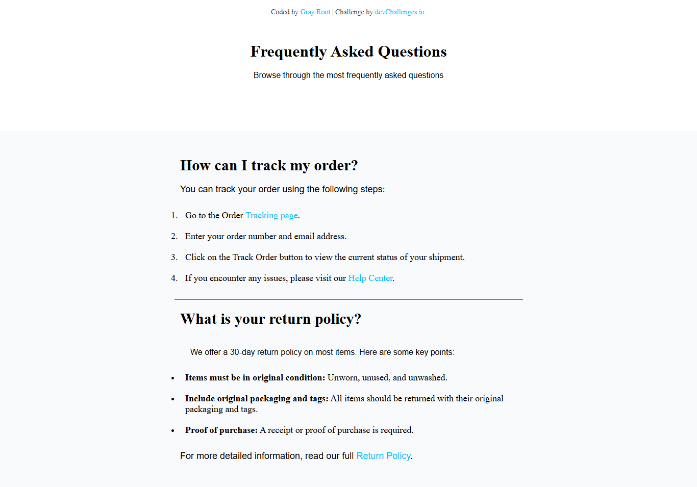

<!-- Please update value in the {}  -->

<h1 align="center">{FAQ-Page} | devChallenges</h1>

   Solution for a challenge <a href="https://devchallenges.io/challenge/simple-faq-challenge" target="_blank">Simple FAQ</a> from <a href="http://devchallenges.io" target="_blank">devChallenges.io</a>.

  <h3>
    <a href="https://devchallenges.io/challenge/simple-faq-challenge">
      Challenge
    </a>
  </h3>

<!-- TABLE OF CONTENTS -->

## Table of Contents

- [Overview](#overview)
- [What I learned](#what-i-learned)
- [Built with](#built-with)
- [Features](#features)
- [Contact](#contact)

<!-- OVERVIEW -->

## Overview

### What I learned

 While building this simple FAQ webpage, I learned how to structure a web page using semantic HTML elements like 
, <h1>, 
, <ol>, and <ul>. I also gained experience linking a CSS file and using internal styles to control layout and design. I learned how to apply fonts, colors, spacing, and backgrounds using CSS, and how to style links with different states like :hover and :visited. Additionally, I discovered how to make the page more user-friendly by centering content and organizing sections clearly. 

### Built with

 

- Semantic HTML5 markup
- CSS custom properties
- Vanilla CSS (no frameworks)
- Responsive design with viewport meta tag
- Visual Studio Code
- Git & GitHub for version control

## Features

 ✅ Clean, responsive layout using semantic HTML5 and structured sections

📌 Frequently Asked Questions section with organized headings and lists

🔗 Styled hyperlinks with hover effects for better user experience

🎨 Light background with styled text for readability

📄 Structured lists using <ol> and <ul> elements for clarity

✨ Custom horizontal line (
) styled and centered for visual separation

📱 Responsive meta tag included to adapt to mobile devices

 :) -->

This application/site was created as a submission to a [DevChallenges](https://devchallenges.io/challenges-dashboard) challenge.

## Author

- GitHub [@nati-sebhat](https://{github.com/nati-sebhat})
